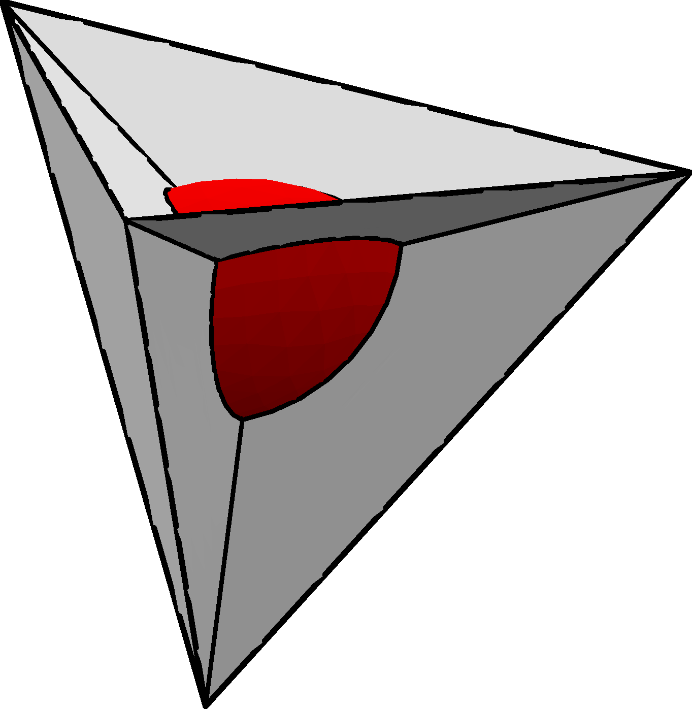

My research interests are in algebraic geometry. Below is a description of some of my projects.

### Moduli spaces of Non-special curves
My most recent paper, joint with Alexander Polishchuk is [Birational models of M_2,2 arising as moduli of curves with nonspecial divisors](https://arxiv.org/abs/1807.09746). We give geometric characterizations of the stable curves for various stability conditions, and then use the explicit coordinates to show that one of the moduli spaces is the blow down of the Weierstrass divisor.

### Strange duality
This work is concerned with a conjecture of Le Potier about a "strange duality" for sections of theta bundles on moduli spaces of sheaves on surfaces. We considered the case of del Dezzo surfaces. Our result (joint with Aaron Bertram and Thomas Goller) provides supporting evidence for this conjecture by performing two very different computations: a computation of sections of the theta bundles on Hilbert schemes (via a theorem of Ellingsrud, Goettsche, and Lehn) and a multiple point computation (from a algorithm suggested by Marengell and Rimanyi). Surprisingly, these two computations match!

Our paper is on the arXiv: [Le Potier's strange duality, quot schemes, and multiple point formulas for del Pezzo surfaces](https://arxiv.org/abs/1610.04185).

My [thesis](http://content.lib.utah.edu/cdm/ref/collection/etd3/id/4206) contains some things not in the paper, such as a the full output of our computations, but the paper above should be preferred for most purposes.

My more recent paper [Universal Series for Hilbert Schemes and Strange Duality](https://arxiv.org/abs/1708.05743) explains how the "finite quot scheme method" of strange duality for surfaces (used in our paper above) leads to conjectures connecting certain universal generating series. Parts of my conjecture have now been proved. See [here](https://arxiv.org/abs/1708.08129) and [here](https://arxiv.org/abs/1712.02382). 

### Tropical Geometry
I spent some time thinking about tropical geometry, where replacing multiplication and addition with addition and minimum produces a world where the combinatorial shadows of classical algebraic geometry can be seen. My paper is about understanding the conditions under which a tropical hypersurface is uniquely determined by incidence conditions. [Determining Tropical Hypersurfaces](https://arxiv.org/abs/1509.05815).

### FJRW Theory and Moduli of Curves
For my master's thesis, I proved a result about a mirror symmetry conjecture involving an isomorphism between Frobenius algebras obtained from FJRW theory and an orbifold Milnor ring. My thesis is [here](http://scholarsarchive.byu.edu/etd/2793/), and a small generalization was added and published in [String-Math 2011](http://www.ams.org/books/pspum/085/) as [Landau-Ginzburg Mirror Symmetry for Orbifolded Frobenius Algebras](https://arxiv.org/abs/1111.2508).

Also, as part of my work, I wrote code in [Sage](http://sagemath.org) to compute FJRW invariants. I also wrote some code, inspired by Faber's Maple program, that computed [top intersections](https://rawgit.com/uberparagon/mgn/master/topintersections/_build/html/index.html) on the moduli space of curves. Recently, I wrote some more code that [calculates any product](https://rawgit.com/uberparagon/mgn/master/strataalgebra/_build/html/index.html) on the moduli space. Both of these projects are now [distributed on PyPI](https://pypi.python.org/pypi/mgn/) for easy installation!

### GC/MS algorithms
As an undergraduate in the [IMPACT group](http://impact.byu.edu/), I experimented with various algorithms for analyzing gas chromotography/mass spectrometry data. My write up can be found [here](gcms.pdf). I learned MATLAB while working on this.

### Soap films
My first undergraduate research experience was with Gary Lawlor at BYU, where we investigated a new technique for proving the minimality of certain soap films. My result about the bubble-in-a-tetrahedron (pictured below) was eventually simplified, generalized, and published as [Isoperimetric surfaces with boundary](http://www.ams.org/journals/proc/2011-139-12/S0002-9939-2011-10872-4/), but I have included my [first attempt at writing a mathematical paper here](TSC_main.pdf) because I think the explicit computations are interesting.

